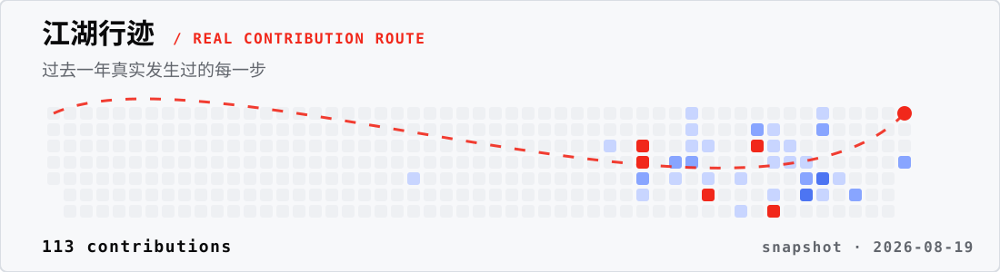

  <a href="https://ggoo.ai">
    <picture>
      <source media="(max-width: 600px) and (prefers-reduced-motion: reduce)" srcset="./assets/hero/ggoo-build-site-mobile-static.svg">
      <source media="(max-width: 600px)" srcset="./assets/hero/ggoo-build-site-mobile-motion.svg">
      <source media="(prefers-reduced-motion: reduce)" srcset="./assets/hero/ggoo-build-site-static.svg">
      
    </picture>
  </a>

 

  <h1>高云宏 · Gao Yunhong</h1>
  
<strong>AlphaCryptoLabs｜AI × Web3 Builder｜全栈 Coder</strong>

  
把模型、数据和工作流，做成可以真正进入现场的产品。

  
<em>Build useful systems at the edge of AI, crypto, and work.</em>

  
<a href="https://ggoo.ai"><strong>GGOOAI ↗</strong></a> &nbsp;·&nbsp; <a href="https://x.com/GSNirvana"><strong>X / @GSNirvana</strong></a> &nbsp;·&nbsp; <a href="https://github.com/MSNirvana"><strong>GitHub / MSNirvana</strong></a>

## 产品矩阵 · Product Portfolio

当前的工作重点，是把 AI 的入口、发现、构建和企业落地连成一条路线。

<table>
  <tr>
    <td width="50%" valign="top">
      <a href="https://ggoo.ai">
        <picture>
          <source media="(max-width: 600px)" srcset="./assets/products/ggoo-ai-station-mobile.svg">
          
        </picture>
      </a>
      
<strong>GGOOAI</strong> · AI Gateway

      <strong>聚合 AI 网关 · AI Gateway</strong> 
      一个入口连接主流 AI 模型，让开发与使用都更简单。
    </td>
    <td width="50%" valign="top">
      <a href="https://open.ggoo.ai">
        <picture>
          <source media="(max-width: 600px)" srcset="./assets/products/open-ggoo-station-mobile.svg">
          
        </picture>
      </a>
      

      <strong>AI 开源热榜 · Open GGOO</strong> 
      聚合 GitHub、GitLab 等来源，发现项目、解释项目，并开放 API、MCP 与 RSS。
    </td>
  </tr>
  <tr>
    <td width="50%" valign="top">
      <a href="https://build.ggoo.ai">
        <picture>
          <source media="(max-width: 600px)" srcset="./assets/products/ggoo-build-station-mobile.svg">
          
        </picture>
      </a>
      
<strong>GGOOAI</strong> · Build Studio

      <strong>AI 建造工作台 · Build Studio</strong> 
      连接咨询、头脑风暴、视觉创作和真实的业务改造。
    </td>
    <td width="50%" valign="top">
      <a href="https://www.zerowalk.ai">
        <picture>
          <source media="(max-width: 600px)" srcset="./assets/products/zerowalk-station-mobile.svg">
          
        </picture>
      </a>
      

      <strong>第零漫步 · ZeroWalk</strong> 
      帮助企业完成 AI 改造，定制真正可用的 Agent 工作流。
    </td>
  </tr>
</table>

## 公开工作 · Open Source Proof

产品之外，下面这些公开仓库记录了正在发生的工作：

| 项目 | 公开定位 | 入口 |
| --- | --- | --- |
|  **Open_GGOO** | AI 开源项目数据、热榜与 Agent 接入模块 | [Website](https://open.ggoo.ai) · [Repo](https://github.com/MSNirvana/Open_GGOO) |
| **github-skill-video-maker** | 为 GitHub 项目、Skills 和开源 AI 项目制作证据型竖屏介绍视频 | [Repo](https://github.com/MSNirvana/github-skill-video-maker) |
|  **ZeroWalk** | Canvas 互动官网与企业 AI 改造工作流入口 | [Website](https://www.zerowalk.ai) · [Repo](https://github.com/MSNirvana/ZeroWalk) |

  <strong>27 public repositories</strong> · 18 followers · JavaScript / Python / Shell / CSS

<picture>
  <source media="(max-width: 600px)" srcset="./assets/activity/contribution-route-mobile.svg">
  
</picture>

## 联系我 · Connect

  <a href="https://ggoo.ai"><strong>GGOOAI</strong></a>
  &nbsp;·&nbsp;
  <a href="https://x.com/GSNirvana"><strong>@GSNirvana</strong></a>
  &nbsp;·&nbsp;
  <a href="https://github.com/MSNirvana"><strong>GitHub</strong></a>

 

Chinese-first / short English labels · AI × Web3 Builder · Build strange things that work.
