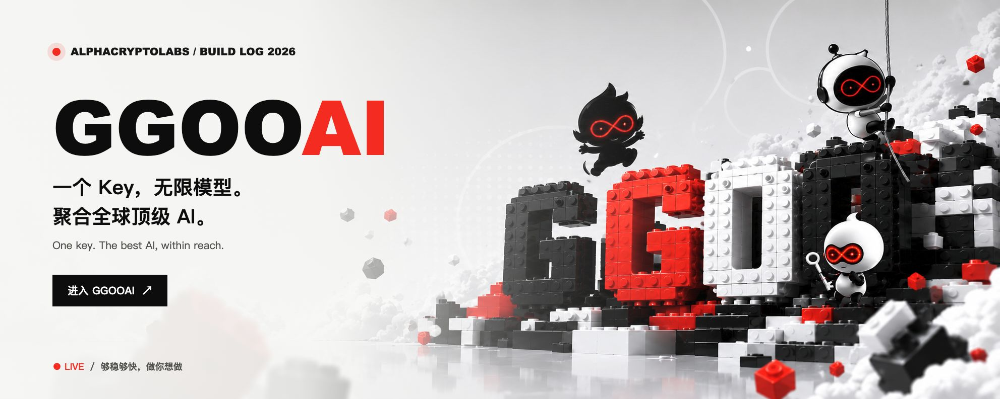
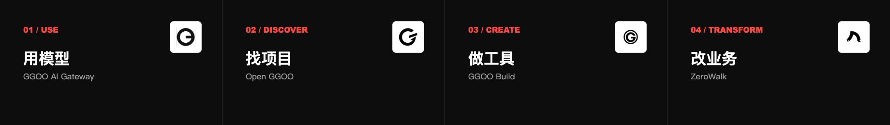
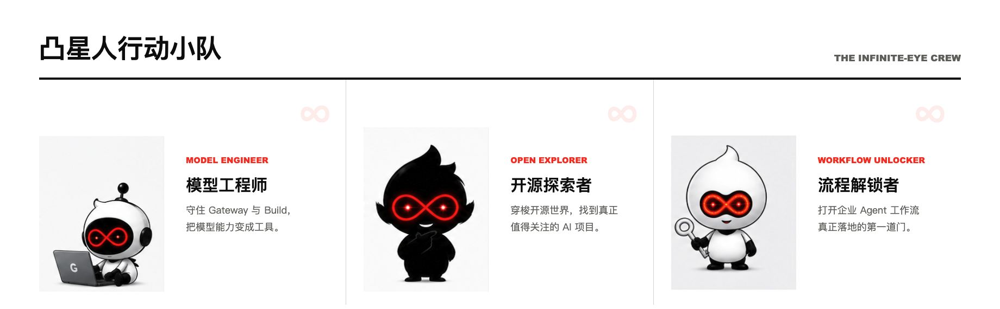
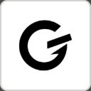
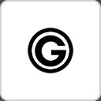
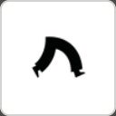
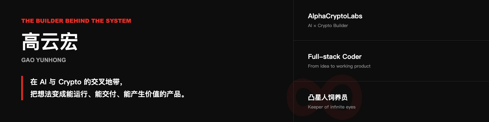
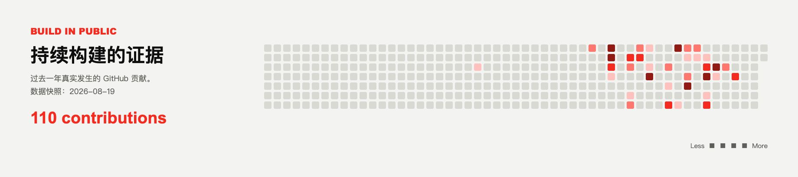

  

 

 

## 让 AI 真正抵达工作现场。

从模型入口，到开源发现、AI 工作台，再到企业 Agent 工作流。**这不是四个孤立产品，而是一条让 AI 产生真实价值的构建路径。**

 

 

## 产品航线 · Product Route

<table>
  <tr>
    <td width="72" align="center"></td>
    <td>
      <strong>01 / USE</strong> 
      <a href="https://ggoo.ai"><strong>GGOO AI Gateway</strong></a> 
      一个入口连接主流 AI 模型，让开发与使用都更简单。 <a href="https://ggoo.ai">进入产品 ↗</a>
    </td>
  </tr>
  <tr>
    <td align="center"></td>
    <td>
      <strong>02 / DISCOVER</strong> 
      <a href="https://open.ggoo.ai"><strong>Open GGOO</strong></a> 
      按真实热度发现全网最新、高价值 AI 开源项目。 <a href="https://open.ggoo.ai">查看热榜 ↗</a>
    </td>
  </tr>
  <tr>
    <td align="center"></td>
    <td>
      <strong>03 / CREATE</strong> 
      <a href="https://build.ggoo.ai"><strong>GGOO Build</strong></a> 
      AI 咨询、头脑风暴与视觉创作的多工具工作台。 <a href="https://build.ggoo.ai">进入工作台 ↗</a>
    </td>
  </tr>
  <tr>
    <td align="center"></td>
    <td>
      <strong>04 / TRANSFORM</strong> 
      <a href="https://www.zerowalk.ai"><strong>ZeroWalk · 第零漫步</strong></a> 
      帮助企业完成 AI 改造，定制真正可用的 Agent 工作流。 <a href="https://www.zerowalk.ai">了解服务 ↗</a>
    </td>
  </tr>
</table>

 

 

## Selected Repositories

| Repository | What it is |
| --- | --- |
| [**Open_GGOO**](https://github.com/MSNirvana/Open_GGOO) | Open GGOO 的开源项目数据与构建仓库。 |
| [**ZeroWalk**](https://github.com/MSNirvana/ZeroWalk) | 面向企业 AI 改造与 Agent 工作流定制。 |
| [**Tooken**](https://github.com/MSNirvana/Tooken) | Bringing AGI to Web4. |

 

 

  <h3>够稳够快，做你想做。</h3>
  
<em>Build strange things that work.</em>

  

    <a href="https://ggoo.ai"><strong>GGOOAI</strong></a>
    &nbsp;·&nbsp;
    <a href="https://x.com/GGOOAI"><strong>@GGOOAI</strong></a>
    &nbsp;·&nbsp;
    <a href="https://github.com/MSNirvana"><strong>GitHub</strong></a>
  

