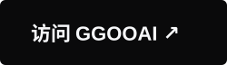
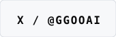
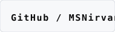
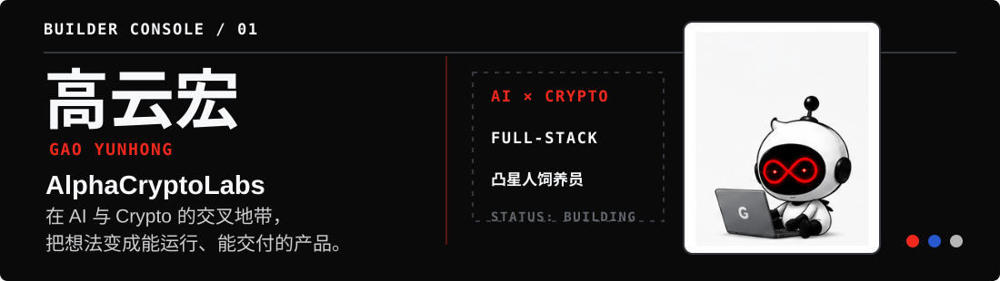
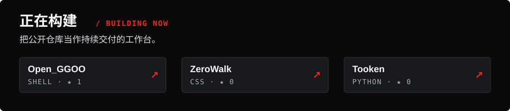

  <a href="https://ggoo.ai">
    <picture>
      <source media="(max-width: 600px) and (prefers-reduced-motion: reduce)" srcset="./assets/hero/ggoo-build-site-mobile-static.svg">
      <source media="(max-width: 600px)" srcset="./assets/hero/ggoo-build-site-mobile-motion.svg">
      <source media="(prefers-reduced-motion: reduce)" srcset="./assets/hero/ggoo-build-site-static.svg">
      
    </picture>
  </a>

 

  
  
  

 

<picture>
  <source media="(max-width: 600px)" srcset="./assets/identity/builder-console-mobile.svg">
  
</picture>

## 产品路线 · Product Route

从一个 Key，到一条真正抵达工作现场的 AI 路线。

<a href="https://ggoo.ai">
  <picture>
    <source media="(max-width: 600px)" srcset="./assets/products/ggoo-ai-station-mobile.svg">
    
  </picture>
</a>

<a href="https://open.ggoo.ai">
  <picture>
    <source media="(max-width: 600px)" srcset="./assets/products/open-ggoo-station-mobile.svg">
    
  </picture>
</a>

<a href="https://build.ggoo.ai">
  <picture>
    <source media="(max-width: 600px)" srcset="./assets/products/ggoo-build-station-mobile.svg">
    
  </picture>
</a>

<a href="https://www.zerowalk.ai">
  <picture>
    <source media="(max-width: 600px)" srcset="./assets/products/zerowalk-station-mobile.svg">
    
  </picture>
</a>

<strong>公开仓库 / PUBLIC WORK</strong> · <a href="https://github.com/MSNirvana/Open_GGOO">Open_GGOO</a> · <a href="https://github.com/MSNirvana/ZeroWalk">ZeroWalk</a> · <a href="https://github.com/MSNirvana/Tooken">Tooken</a>

<picture>
  <source media="(max-width: 600px)" srcset="./assets/repositories/building-now-mobile.svg">
  
</picture>

 

<picture>
  <source media="(max-width: 600px)" srcset="./assets/activity/contribution-route-mobile.svg">
  
</picture>

 

  <h2>够稳够快，做你想做。</h2>
  
<em>Build strange things that work.</em>

  

    <a href="https://ggoo.ai"><strong>GGOOAI</strong></a>
    &nbsp;·&nbsp;
    <a href="https://x.com/GGOOAI"><strong>@GGOOAI</strong></a>
    &nbsp;·&nbsp;
    <a href="https://github.com/MSNirvana"><strong>GitHub</strong></a>
  

Chinese-first / short English labels · AI × Crypto Builder · 凸星人饲养员
